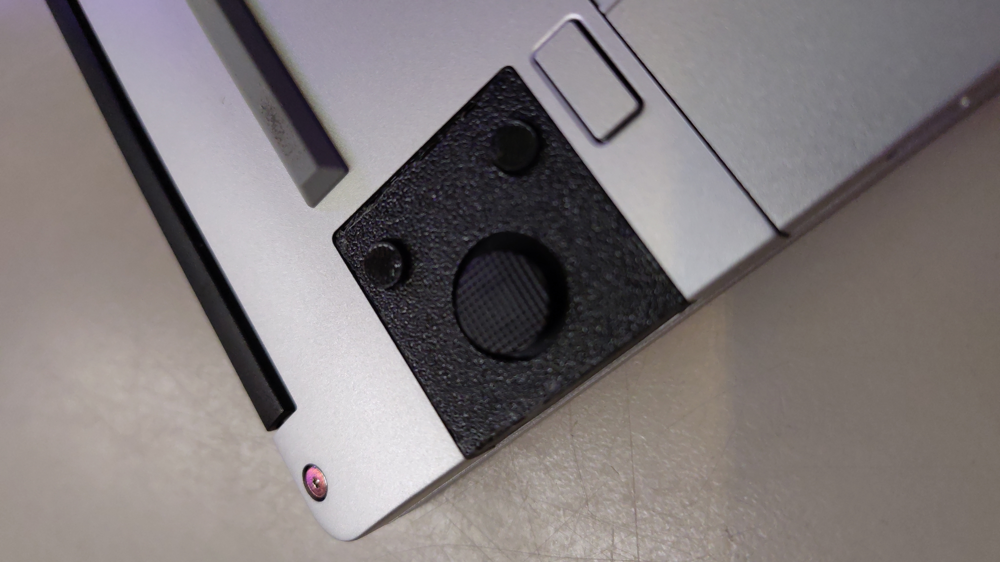
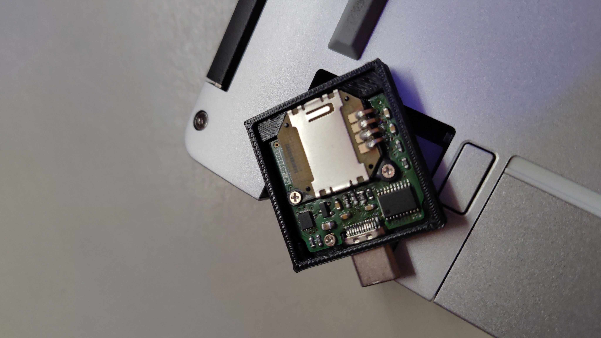
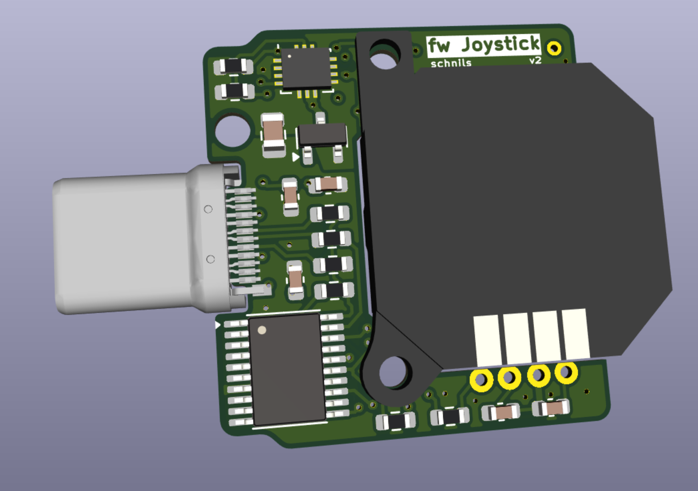
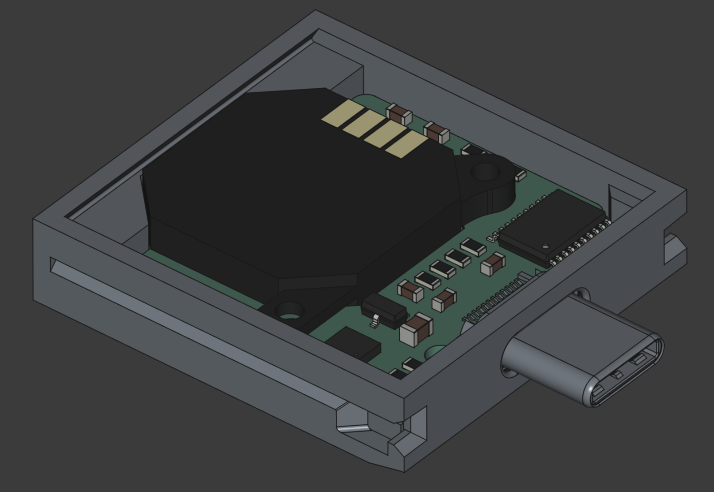

# PSP Joystick Framework Laptop Expansion Card

A joystick expansion card with 2 buttons and the low profile psp joystick.

  &nbsp;
  

This uses the 10cent risc-v ch32v003 with  and its software-USB stack  to power this HID device. 

## PCB

  &nbsp;
  

## Thanks

Thanks to LeoDJ for open sourceing his  which this is based upon.